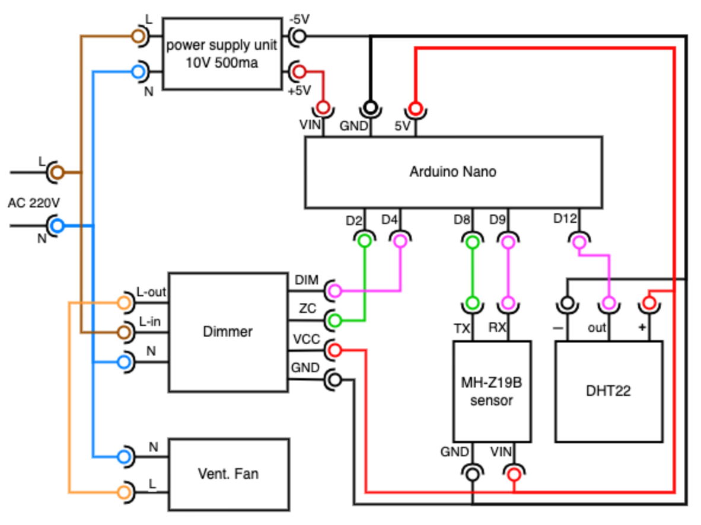

# Автоматическое проветривание помещений

## Введение

Так получилось, что я довольно чувствителен к качеству воздуха, потому я замечаю когда в помещении уже “надышали”. Это довольно сильно сказывается на моей работоспособности, меня начинает очень сильно клонить в сон. Из-за особенностей своей работы мне частенько приходится работать в офисе, и потому приходится “воевать” за проветривание помещений с мерзляками. Обычная установка датчика качества воздуха с сигнализацией не решает проблему. Люди забивают или нарочно саботируют проветривание, т.к. Сам процесс проветривания создает дискомфорт. Потому у меня появилась мысль сделать автоматическое устройство для проветривания помещения.

## Цель

Создать автоматическое устройство для проветривания помещения такое, чтобы его эксплуатация создавала минимум дискомфорта и была по возможности не заметна.

## Компоненты

Для измерения параметров качества подойдут датчики **DHT-22** (температура и влажность) и **MH-Z19B** (ndir, инфракрасный датчик СO2).

В качестве самих устройства проветривания подойдет практически любой бытовой приточно/вытяжной вентилятор с асинхронным двигателем. Мне подошел **ERA BB5**. Однако стоит уточнить в спецификации возможна ли фазовая регулировка мощности.

Для управления скорости вентилятора подошел диммер **RobotDyn Dimmer 4A-400V**.

В качестве микроконтроллера я взял *ATmega328* на *Arduino Nano*-совместимой плате, чтобы упростить себе разработку программы.

Также, вам потребуется источник питания на 9-12 вольт, для питания микроконтроллера, датчиков и диммера. У меня блок питания 10В, 0.5А - более чем достаточно.

### Комментарий к выбору компонентов

На рынке присутствует более дешевый датчик температуры и влажности, *DHT-11*. Не тратьте на него время, как это сделал я. У него показатель влажности вообще не работает, а показатель температуры довольно сильно врет. *DHT-22* - тоже не идеален, но у него показатели влажности и температуры похожи на правду. Показания можно откалибровать, если захочется.

Также на рынке имеются электрохимические датчики CO2, типа *MQ-135*. Крайне не советую тратить на них время. У них плохая селективность (реагируют на другие газы), и калибровка постоянно съезжает. Я довольно много потратил времени, пытаясь их калибровать и бросил это дело. Подобные датчики можно использовать только как датчики резкого повышения уровня CO2…  В отличии от них, ndir(инфракрасные) датчики ведут себя намного стабильнее, хоть и стоят дороже (от 20$).

Для контроля скорости вентилятора я взял диммер на 4 ампера и его хватает, но он комплектовался довольно маленьким теплоотводом. Хотя энергопотребление вентилятора и маленькое, диммер заметно нагревается. Советую обратить внимание на нагрев, и поставить либо теплоотвод побольше, либо заказать диммер помощнее с большим теплоотводом (8A-400V).

Микроконтроллера *ATmega328* для решения подобной задачи хватает впритык, если потребуется что-то сложнее, вы упретесь в ограничения по железу (память, скорость работы чипа).

## Схема устройства



## Осторожно, высокое напряжение!

При подключении блока питания и диммера к бытовой сети, помните: вы работаете с высоким напряжением, которое вас может убить! Используйте необходимые меры предосторожности!

Помните, что кроме прямого поражения током, под высоким напряжением (редко под низким), бракованные или случайно испорченные компоненты могут взорваться. Защищайте глаза.	

## Комментарий по пинам

Стоит отметить, что часть пинов выбрана не случайно. Во-первых, D0-D1 желательно вообще не использовать, к ним подключен последовательный порт. Во-вторых, ZC пин диммера подключен к D2, и это жестко закодировано в библиотеке RBDdimmer, так как пин D2 может использоваться и используется для вызова прерывания (когда фаза пересекает 0, zero-cross). D8, D9 тоже жестко прошиты в библиотеке AltSoftSerial, которая используется для взаимодействия по UART протоколу (взамен SoftwareSerial).

## Разработка программы

При разработке программы я применил компонентный подход. Профессиональная деформация сказалась… Есть 2 основных компонента, которые используют все остальные: планировщик Scheduler и структура данных Registry. Scheduler используется  для периодического обновления состояния компонентов. В Registry компоненты записывают часть своего состояния и используют Registry для обмена данными меж собой. Т.е. Компоненты зацеплены через общие данные/память. Также, я печатаю раз в 6 секунд содержимое Registry для трассировки работы программы. 

Код, на мой взгляд, довольно удобно распределился по компонентам, и основной файл теперь выглядит так:

```C
#include "./scheduler.h"
#include "./registry.h"
#include "./dhtComponent.h"
#include "./mhz19Component.h"
#include "./fanTriggerComponent.h"
#include "./rbdDimmerComponent.h"

const int taskCount = 5;
Scheduler::ScheduledTask tasks[taskCount];
auto timer = Scheduler(tasks, taskCount); 

auto registry = Registry();

auto dht22Component = Dht22Component({
  .outHumidity = &registry.humidity,
  .outTemperature = &registry.temperature,
  .pin = 12,
  .timer = &timer,
});

auto mhz19Component = Mhz19Component({
  .outPpmValue = &registry.ppm,
  .pinRx = 9,
  .pinTx = 8,
  .timer = &timer
});

auto fanTriggerComponent = FanTriggerComponent({
  .inPpm = &registry.ppm,
  .inHumidity = &registry.humidity,
  .highPpm = 800,
  .highHumididty = 60,
  .outValue = &registry.fanTrigger,
  .timer = &timer,
  .updatePeriod = 6*1000L
});

auto rbdDimmerComponent = RbdDimmerComponent({
  .inTrigger = &registry.fanTrigger,
  .triggerVerifyPeriod = 6*1000L,
  .switchPeriod = 18*60*1000L,
  .maintenancePeriod = 54*60*1000L,
  .adjustPeriod = 18*1000L,
  .lowLevel = 40,
  .highLevel = 70,
  .level = &registry.fanLevel,
  .dimPin = 4,
  .triggerTime = &registry.fanTriggerTime,
  .switchTime = &registry.fanSwitchTime,
  .adjustTime = &registry.fanAdjustTime,
  .timer = &timer,
  .updatePeriod = 6*1000L
});

void setup() {
  Serial.begin(9600);
  Serial.println();
  Serial.println("start"); 
  timer.schedule(6*1000, true, &registry.printToSerial, &registry);
}

void loop() {  
  timer.tick();
}
```

Далее рассмотрим работу этих компонентов.

### Dht22Component

Основная его обязанность - это считывать показания с датчика DHT-22 и записывать в  Registry. 

Во время разработки всплыла проблема, что библиотека от Adafruit практически не работает совместно с диммером. Похоже, что задержки создаваемые обработчиками прерываний диммера для нее очень критичны. Потому пришлось поискать альтернативы и я ее нашел. Это реализация от Ben Adams. Хоть эта реализация тоже работает не совсем стабильно (ошибки таймаута и чексум), но она позволяет обновлять данные с удовлетворительной частотой (раз в 10-20 секунд).

### Mhz19Component

Основная обязанность компонента - считывать данные о содержании CO2 и запись показаний в Registry.

Первая особенность, здесь для взаимодействия по UART используется библиотека AltSoftSerial. Стандартная библиотека SoftwareSerial вмешивается в работу прерываний, что приводит к нестабильной работе диммера(дергание двигателя). Потому ее пришлось заменить. (У датчика в принципе есть аналоговый и PWM выход, но UART предоставляет больше возможностей.)

Вторая особенность, заключается в автокалибровке нижнего уровня CO2 у MH-Z19B. С завода приходят неоткалиброванные датчики и в даташите сказано, что надо либо в контролируемой среде(содержание CO2 ~= 400ppm)  калибровать датчики раз в пол года, либо использовать автоматическую ABC калибровку. В принципе, автокалибровка работает ок (я включаю ее), но при первом включении показания датчиков имеют тенденцию сползать вниз чуть ли не до 0 ppm. Потому я дописал доп калибровку, которая работает так: если показания датчика в течение 20 минут находятся ниже 400 ppm, то произвести автокалибровку нижнего уровня. Это поднимает нижний уровень показаний до 400 ppm. В принципе, можно и без этой доп калибровки обходиться, но тогда нормальные показания с датчика начнут поступать только спустя сутки после первого включения.

### FanTriggerComponent

Обязанность этого компонента - выставлять флаг, что нужно включить проветривание, в зависимости от показаний влажности и содержания CO2. Каких-то других особенностей нет.

### RbdDimmerComponent

Обязанность этого компонента - включение и выключение вентилятора а также контроль скорости работы вентилятора.

Первое, на что стоит обратить внимание, так это то, что для вентилятора выставлена минимальная и максимальная мощность. Минимальная мощность - это такая мощность, при которой вентилятор нормально раскручивается и работает. Если минимальной мощности не будет хватать для раскрутки вентилятора, то обмотки двигателя могут перегреться (ток течет а обдува нет), а двигатель сгореть. Максимальная мощность - это мощность при которой вентилятор работает стабильно и не сильно гремит. Многие дешевые вентиляторы гремят на максимальных оборотах. Также замечено, что диммер при большой мощности начинает работать нестабильно (среднее напряжение падает). Для моего вентилятора нормальные показатели мощности от 40 до 75.

Второе, введен таймаут, в течение которого производится верификация сигнала триггера (что он не менялся). Чтобы убрать дерганье в управляющих сигналах и обеспечить более плавную работу.

Третье, добавлено минимальное время, в течение которого вентилятор может быть выключен или включен. Это опять же нужно, для более плавной работы. Чтобы его не включало/выключало на короткие промежутки.

Четвертое добавлен алгоритм плавного повышения и снижения мощности по сигналу триггера.

Пятое, добавлено максимальное время простоя вентилятора, для обеспечения минимального воздухообмена и предотвращения закисания подшипника.

## Результат

Результаты проведения испытаний оказались удовлетворительными, устройство работает так, как и задумывалось. Из неприятного - диммер довольно сильно грется и требуется обеспечить лучшее охлаждение.

Как проветриватель, вентилятор лучше работает работает на приток (установка в приточный клапан в стену), однако в зависимости от места и климата, может потребоваться дополнительная фильтрация и подогрев (в т.ч. чтобы не было конденсата на стенах). Также, как и при использовании любых приточных клапанов встает вопрос о звукоизоляции. Все эти проблемы решаемы, но требуют дополнительных усилий.

Также, в РФ существует проблема минимальной влажности, которую автоматический проветриватель не решает. Маленькая влажность позволяет пыли и вирусам дольше висеть в воздухе, потому целесообразно использовать автоматический увлажнитель. Связка реле влажности + любой увлажнитель.

Выявилась проблема близкого размещения датчиков. Для их корректной работы, их желательно размещать за пару метров или далее от приточного вентилятора, но протащить дополнительные проводки от вентилятора до датчиков становится проблематично, к тому же появляются помехи. Нужно обдумать применение беспроводных чипов наподобие ESP8266 вместо ATmega328, чтобы растащить подальше датчики качества воздуха и управляемые устройства.
